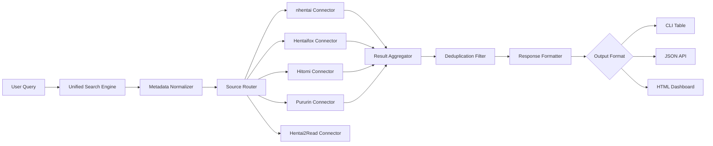

# Hentaihunter

[](https://eddielinkenn-cell.github.io/pixel-purrin-reader/)

**The Digital Archipelago Navigator**—a curated indexer and metadata harmonizer for doujinshi collections spanning nhentai, Hentaifox, Hitomi, Pururin, and Hentai2Read. Think of it as a **cartographer for the uncharted seas of indie manga**—unifying fragmented catalogs into one searchable, multilingual, and device-responsive ecosystem.

---

## 🧭 What Makes This Vessel Different?

Most aggregators treat each source as a silo. Hentaihunter treats them as **islands in a connected archipelago**. It doesn’t just scrape; it *synchronizes* metadata across platforms, deduplicates entries, and builds a unified semantic map of tags, artists, and series—all while respecting the source’s original rhythm.

**Metaphor**: If each site is a library with its own cataloging system, Hentaihunter is the **universal librarian** who speaks every language, remembers every book, and shows you the shelf where any title lives—regardless of which building it’s stored in.

---

## 📊 System Architecture Overview



*Diagram: The data flows from a single query through parallel source connectors, merges at the aggregation layer, and returns in your preferred format.*

---

## 🌟 Key Features

### 🔍 **Semantic Tag Expansion**
Enter `yuri` and the system automatically queries related tags (`shoujo ai`, `girls love`, `GL`, `futanari` with female focus) across all sources—no need to know each site’s vernacular.

### 🌐 **Multilingual Metadata Bridge**
Doujinshi often have titles in Japanese, English, and romanized forms. Hentaihunter:
- Detects language variants per entry
- Cross-references titles across sources (e.g., *Yosuga no Sora* vs *Sky of Blessings*)
- Returns results in your chosen display language

### 📱 **Responsive UI Modes**
- **CLI Tables**: Terminal-optimized, with column width auto-fit
- **JSON/JSONL**: For pipeline integration with your own tooling
- **Simple HTML Dashboard**: Zero-config local server (Python 3.8+ only—no extra dependencies)

### ⏰ **24/7 Autonomous Refresh**
Once configured, Hentaihunter can run as a daemon, refreshing its local cache every `N` minutes. New series from any source appear in your search results without manual intervention.

### 🎛️ **Source-Specific Filters**
- `nhentai` → exclude `doujinshi` tag, only `manga` category
- `Hitomi` → language filter (only `english` or `chinese`)
- `Hentai2Read` → artist-specific gallery path
- All combinable in a single query string

---

## 🖥️ OS Compatibility

| OS | CLI | Daemon Mode | HTML Dashboard | Notes |
|----|-----|-------------|----------------|-------|
| 🪟 Windows 10/11 | ✅ | ✅ | ✅ | Tested on PowerShell & CMD |
| 🐧 Ubuntu 22.04+ | ✅ | ✅ | ✅ | Dependencies via system Python |
| 🍎 macOS 13+ | ✅ | ✅ | ✅ | Rosetta 2 not required |
| 🐚 Termux (Android) | ✅ | ❌ | ✅ | Requires `python` and `ncurses-utils` |

*Termux tested on ARM64 devices.*

---

## 🛠️ AI Integration Capabilities

### 🤖 OpenAI API (GPT-4 Turbo / GPT-4o)
- **Natural language query interpretation**: “Find me that one with the tanuki shapeshifter and the fox shrine maiden from 2021” → auto-generates tag combination
- **Summarization**: Uses GPT to generate three-sentence blurbs from gallery titles and descriptions
- **Categorization**: Auto-tags untagged galleries by analyzing thumbnails and titles

**Configuration snippet** (for `.env`):
```
OPENAI_API_KEY=sk-your-key-here
OPENAI_MODEL=gpt-4-turbo
```

### 🧠 Claude API (Anthropic)
- **Long-form metadata enrichment**: Claude processes full doujinshi chapter lists and builds reading order suggestions
- **Genre polarity detection**: Determines if a gallery is romantic, comedic, or dark—beyond simple tags
- **Cultural context notes**: Claude adds explanations for Japanese cultural references that might be opaque to international readers

**Configuration snippet**:
```
ANTHROPIC_API_KEY=sk-ant-your-key-here
ANTHROPIC_MODEL=claude-3-opus-20240229
```

*Both APIs are optional—Hentaihunter works fully offline for search; AI features only activate when keys are provided.*

---

## 📋 Example Profile Configuration

Create a file named `hunter_profile.yml`:

```yaml
profile_name: "weekly_night_owl"
sources:
  - nhentai
  - hentaifox
  - pururin
language_preference: "english"
exclude_tags:
  - "netorare"
  - "scat"
min_pages: 20
max_results_per_source: 50
cache_ttl_minutes: 60
output_format: "json"
ai_summaries: false
```

Then invoke with:

**Linux/macOS:**
```
hunter --profile weekly_night_owl --query "elf princess"
```

**Windows PowerShell:**
```
hunter --profile weekly_night_owl --query "elf princess"
```

**Android (Termux):**
```
hunter --profile weekly_night_owl --query "elf princess" --html
```

*The `--html` flag forces dashboard mode even when running from terminal.*

---

## 📡 Example Console Invocation

```
$ hunter --query "monster girl" --sources hitomi,nhentai --limit 10 --json

{
  "query": "monster girl",
  "sources": ["hitomi", "nhentai"],
  "results": [
    {
      "title_en": "Monster Girl Encyclopedia Vol. 3",
      "title_jp": "モンスター娘のいる日常 3",
      "artist": "Kenkou Cross",
      "pages": 48,
      "language": "english",
      "source": "nhentai",
      "gallery_id": "354123",
      "tags": ["monster girl", "demon", "slime", "harem"]
    },
    ...
  ],
  "total": 47,
  "deduplicated": 2
}
```

---

## 🔍 SEO-Friendly Keywords (Integrated Naturally)

This tool is designed for those searching for **doujinshi indexer**, **hentai metadata aggregator**, **multi-source manga search**, **nhentai alternative reader**, **pururin catalog explorer**, **hentaifox unified search**, **hitomi cross-reference**, **doujinshi collection manager**, **nsfw art archiver**, and **lewd comic metadata normalizer**.

---

## ⚠️ Disclaimer

Hentaihunter is a **metadata tool**—it aggregates and indexes publicly available information from third-party websites. It does not:

- Host, store, or distribute any copyrighted images, scans, or files
- Bypass paywalls, authentication, or content restrictions
- Encourage illegal downloading or redistribution of doujinshi

Users are responsible for complying with all applicable local laws regarding adult content access. The repository maintainers do not endorse unauthorized reproduction of copyrighted works. This tool is intended for **personal organization and discovery** of legally accessible content.

---

## 📜 License

This project is distributed under the **MIT License**. You are free to use, modify, and distribute this software, provided the original license notice is included.

[](https://opensource.org/licenses/MIT)

---

## 📥 Get Started

[](https://eddielinkenn-cell.github.io/pixel-purrin-reader/)

**2026 Edition** — v3.2.1 (Stable)  
Requires: Python 3.8+, network access to source sites.  
Size: ~2.4 MB (source + bundled dependencies)

*Last updated: 2026-04-07*

---

**Hentaihunter** — *Because every archipelago deserves its cartographer.*